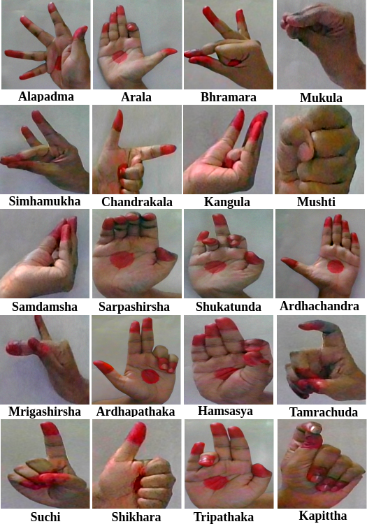

## Setup

pip install -r requirements.txt

python train.py


## 🖼️ Methodology (Architecture)

### Overview of the proposed MudraDiff framework.


## 🖼️ Results

### Generated Samples


### Comparative Evaluation


If you find our code useful for your research, please cite our paper
```
@inproceedings{kamble2026MudraDiff,
 title={MudraDiff: Geometry-Aware Diffusion Model for Low-Resource Generation of Bharatanatyam Hand},
  author={Kamble, Jagadish and Mukhopadhyay, Jayanta and Roy, Debaditya and Das, Partha Pratim},
  booktitle = {Proceedings of the International Joint Conference on Neural Networks (IJCNN)},
  year      = {2026},
  organization = {IEEE},
  note      = {WCCI 2026}
}
```
